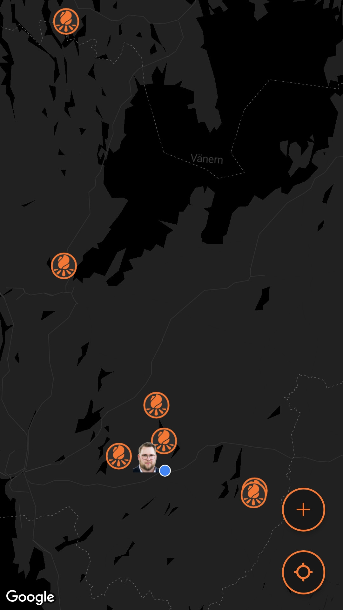

# Inlämningskrav för VG

## Inlämning

Lägg in den här filen i rooten av ditt projektet. Se sedan till att lägg till bilder och andra filer som behövs i projektet också och uppdatera länkarna nedan i det här dokumentet.

När du är klar zippar du ihop projektet (utan node_modules) och lämnar in inlämningen på nytt i Google Classroom.

**OBS: Öppna den här filen som preview så du ser att dina länkar är rätt. Om bilder inte visas så kommer VG kompletteringen inte att godkännas.**

## Förbered appen

Utöver det som ska anges i den här filen så ska du även lägga till en appikon och en splashscreen i [app.json](./app.json) filen samt eventuella andra inställningar om du har använt dig av exempelvis kameran eller GPS'en, den informationen finns dokumenterad för respektive modul i Expo referensen.

**Det här måste göras innan du bygger appen.**

## Skyltfönstret i butiken & Bygga appen.

Nu kan du bygga appen med EAS och ladda hem filen när den är klar. Fyll sedan i nedanstående uppgifter som bevis på att du bara är några få steg ifrån att lansera din applikation på butiken.

**Applikationens Namn:** 
Lägerplatser.se

**Kort Beskrivning (max 80):** 
Dela med dig och ta del av information om lägerplatser.

**Fullständig Beskrivning (max 4000):** 
Upptäck nya platser att slå upp tältet på – och hjälp andra att hitta sina favoriter!

Lägerplatser.se är appen för dig som gillar friluftsliv, scouting, paddling, hajker eller bara att komma ut i naturen. Här kan du enkelt dela med dig av tips på bra lägerplatser, se var andra har varit och planera nästa äventyr.

Med Lägerplatser.se kan du:
• Utforska lägerplatser runt om i Sverige – med bilder, beskrivningar och kartvy.
• Lägga till egna platser – bidra till communityn genom att dela dina bästa lägerställen.
• Kommentera och betygsätta – hjälp andra att hitta de mest lämpliga platserna för olika aktiviteter.
• Spara favoriter – håll koll på platser du vill besöka igen.
• Inspireras av andra friluftsentusiaster – bygg tillsammans ett växande nätverk av bra lägerplatser.

Oavsett om du är scoutledare, friluftsmänniska eller bara vill hitta en fin plats för nästa helgutflykt är Lägerplatser.se ett enkelt sätt att planera, dela och upptäcka naturen tillsammans.

Tillsammans gör vi friluftslivet mer tillgängligt.
Ladda ner Lägerplatser.se idag och bidra till kartan över Sveriges bästa lägerplatser!

## Applikationens ikon och laddningsbild.

<figure>
    
    
    
</figure>
<figure>
    
    
    
</figure>

---

 
[Läs mer om dessa bilder här](https://docs.expo.dev/develop/user-interface/splash-screen-and-app-icon/).

En omslagsbild som visas på olika ställen i butiken.

Två till åtta fönsterbilder i formatet 16:9 eller 9:16 samt bredd och höjd mellan 320 och 3840 px.

;
;
;

[Binärfilen](./path/to/build.aab);

;
Tänk på att bilden måste visa både "Created By" och "Start Time".
